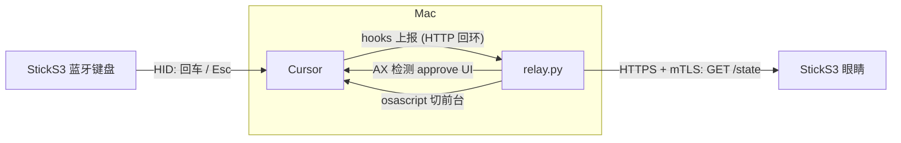

# agent_pet

把 M5StickS3 变成一只"AI agent 宠物":用两颗大眼睛的**颜色**表达 agent 状态,
同时它是一个**蓝牙键盘**,按一下机身按键就能敲快捷键、批准 agent 的原生 approve。

- 黄眼 = 忙碌 (agent 正在干活)
- 红眼 = 等待批准 (检测到卡在原生/企业强制 approve) + 自动把 Cursor 切到前台
- 绿眼 = 空闲 / 完成

先支持 **Cursor**,架构可扩展到 Claude Code / Codex(状态上报)。

## 架构 (两条独立通道, 各管各的)



- **蓝牙**:StickS3 是个**纯 HID 键盘**,macOS 当普通蓝牙键盘连。按键直接吐键,
  零依赖、最稳 —— 避开了 "HID + 自定义 GATT 共存" 在 macOS 上的各种坑。
  - BtnA 单击 = **回车 (Enter)** → 批准
  - BtnA 长按1秒 = **Shift+回车** → 批准 (场景二)
  - BtnB 单击 = **Esc** → 取消/拒绝
- **WiFi (HTTPS + 双向 TLS)**:agent 状态走 WiFi。StickS3 连上局域网后, 定时向
  Mac 上 relay 的 `GET /state` 拉聚合状态驱动眼睛。这条链路是 **mTLS**:
  - StickS3 烧入客户端私钥+证书, relay 用它的公钥(证书)**强制验证设备身份**(没有
    正确证书的客户端 TLS 握手直接被拒) —— 即"公钥认证"。
  - StickS3 反过来用 relay 的自签证书当 CA 校验 server(本 core 的 `setInsecure()`
    会导致不发客户端证书, 所以必须走 CA 校验模式)。
  - relay 拆两个口:本地 `127.0.0.1:8799` 普通 HTTP 收 Cursor hook 上报(回环不出
    网卡);对外 `0.0.0.0:8443` 才是 HTTPS+mTLS, 只服务 StickS3 的 `/state`。
  - 证书由 `relay/gen_certs.sh` 用 openssl 一键生成 (EC P-256)。**server 证书的
    SAN 会写入运行 `gen_certs.sh` 时探测到的 Mac 局域网 IP**, 设备按 IP 连才能过
    校验 —— 所以 **Mac 的局域网 IP 变了 (换网络/DHCP), 要重跑 `gen_certs.sh` 并
    重烧固件**。

> 实现要点 (踩过的坑):
> - relay 的 TLS 握手放在每连接的工作线程里 (不能包在监听 socket 上, 否则一个慢
>   握手会卡死 accept, 表现为客户端 connection refused)。
> - 设备侧 mbedTLS 握手很吃栈, netTask 给了 48KB (16~20KB 会栈溢出, 握手失败)。
> - 轮询用持久 `WiFiClientSecure` 复用, 避免每次新建解析证书导致的堆泄漏。

### 审批检测 (relay 两层)

企业场景里 Cursor 可能强制人工 approve,hook 返回 `allow` 也绕不过。所以
**hook 一律放行、绝不拦截**,由 relay 判断"是否卡在审批",判到了把状态标红
(眼睛变红)并把 Cursor 切前台,你按 StickS3 的回车键即可批准:

1. **首选 AX** (`relay/ax_detect.py`):看 Cursor 的 Accessibility 树里有没有
   `Run` 之类的审批**按钮**(精确匹配按钮文案)。最准,需要"辅助功能"权限。
2. **回退启发式**:某命令 `before` 后超过阈值仍没 `after` 且对话静默 → 判等待。

## 目录

```
agent_pet/
  firmware/        StickS3 固件 (Arduino / M5Unified)
    firmware.ino   主循环: 眼睛 + 按键 + 蓝牙键盘 + WiFi
    eyes.*         眼睛动画引擎 (状态驱动颜色)
    ble_kbd.*      纯 BLE HID 键盘 (BtnA=回车 / BtnB=Esc)
    net.*          WiFi + SoftAP 配网 + mTLS 轮询 relay /state (独立 task)
    certs.h        (gen_certs.sh 生成) 客户端私钥+证书, 不入库
    app_prefs.*    NVS 配置 (亮度/音效)
    flash.sh       编译 + 烧录
  hooks/           Cursor hook (全 allow + 上报活动)
  relay/           Mac 中枢 (HTTP 回环收 hook + HTTPS mTLS 出 /state)
    relay.py  ax_detect.py  gen_certs.sh  requirements.txt
    certs/         (gen_certs.sh 生成) server.* + client.crt, 不入库
  tools/           transcript_probe.py (兜底验证脚本)
  install.sh
```

## 安装与使用

### 1. Mac 侧

```bash
cd agent_pet
./install.sh            # 装 Cursor hooks + 依赖(pyobjc) + 默认配置
./relay/gen_certs.sh    # 生成 mTLS 证书 (relay/certs/ + firmware/certs.h)
python3 relay/relay.py  # HTTP 回环:8799 (hook) + HTTPS mTLS:8443 (StickS3)
```

> **顺序重要**:`gen_certs.sh` 必须在编译固件**之前**跑,因为它会生成
> `firmware/certs.h`(固件要 include)。证书/私钥都在 `.gitignore` 里,不入库;
> 换机器重新生成即可(生成新证书后要重新烧固件 + 重启 relay)。

relay 启动会打印 **Mac 局域网 IP** 和 HTTPS 端口(配网时要填)。推荐给运行 relay 的
终端授"辅助功能"权限(系统设置 → 隐私与安全性 → 辅助功能)以启用 AX 精准检测。

### 2. 烧固件

```bash
firmware/flash.sh       # 进入下载模式: 长按机身侧面 reset ~2 秒
```

### 3. StickS3 配网 (WiFi)

首次启动没有 WiFi 配置 → 自动开热点 **AgentPet-XXXX**:
1. 手机/电脑连这个热点
2. 浏览器打开 <http://192.168.4.1>
3. 填:WiFi 名称、WiFi 密码、**Relay 地址**(填 relay 打印的 `Mac IP:8443`,注意是
   HTTPS 端口 **8443**)
4. 保存 → StickS3 重启并连 WiFi,经 mTLS 轮询 relay,眼睛动起来

(以后想改配置:**长按 BtnB** 重进配网热点,或联网后浏览器直接打开屏幕右下角那个 IP。)

### 4. 连蓝牙键盘

系统设置 → 蓝牙,把 **AgentPet** 当键盘连接。若弹出"键盘设置助理"要求按键识别,
用你的**内置键盘**按它要求的键完成(或关掉它,按默认 ANSI)。

### 5. 在 Cursor 里对齐快捷键

确保 Cursor 审批的"运行/接受"快捷键是**回车**(默认通常就是),取消是 **Esc**。
这样 StickS3 的 BtnA/BtnB 直接对应。

## 按键

| 按键 | 功能 |
|------|------|
| BtnA 单击 | 敲**回车** → 批准 |
| BtnA 长按1秒 | 敲 **Shift+回车** → 批准 (场景二) |
| BtnB 单击 | 敲 **Esc** → 取消/拒绝 |
| BtnB 长按 | 进入 WiFi 配网 (SoftAP) |

顶栏三个小点:HID(绿=蓝牙键盘已连) / WiFi(蓝=已联网) / relay(白=拿到状态)。

## 配置

`~/.config/agent_pet/config.json` (relay + hook 共用):

```json
{
  "url": "http://127.0.0.1:8799",
  "activity": true,
  "app_name": "Cursor",
  "detect_mode": "auto",
  "wait_threshold_ms": 2500,
  "activate_on_wait": true
}
```

- `url`: hook 上报地址 (回环, 固定)
- `detect_mode`: `auto`(AX 优先,不可用回退启发式) / `ax` / `heuristic` / `off`
- `app_name`: 要检测/切前台的应用名 (默认 Cursor)
- `ax_keywords`: 额外的审批按钮文案 (精确匹配, 追加到内置的 `run` 等)

> 按键敲的是固件里写死的回车/Esc, 不在这里配。WiFi 配置存在 StickS3 的 NVS 里
> (配网页填), 不在这个文件。

## 验证脚本

```bash
# AX 能否看到 Cursor 的审批按钮 (审批弹出时跑)
python3 relay/ax_detect.py buttons          # 列出当前所有按钮
python3 relay/ax_detect.py watch            # 实时看 approve_ui 是否命中
python3 relay/ax_detect.py dump --grep Run

# 兜底: transcript JSONL 能否区分悬空 tool 调用
python3 tools/transcript_probe.py --auto

# mTLS 自测 (relay 跑着时): 带证书应返回 JSON, 不带证书应被拒
curl -sk --cert relay/certs/client.crt --key relay/certs/client.key \
  https://127.0.0.1:8443/state
curl -sk https://127.0.0.1:8443/state   # 应失败 (exit 35)
```

## 排错

- 眼睛不动:顶栏 WiFi 点是不是蓝的?relay 点是不是白的?
  - WiFi 蓝但 relay 不白:
    - relay 地址/端口不对(要 `IP:8443`,HTTPS 端口);
    - **换了网络 / Mac 局域网 IP 变了** —— server 证书 SAN 绑了旧 IP, 重跑
      `gen_certs.sh` + 重烧固件 + 重启 relay;
    - 证书不匹配(重跑过 `gen_certs.sh` 但没重烧固件): 两边证书要同一套;
    - 想看具体 TLS 失败原因: `AGENT_PET_DEBUG=1 python3 relay/relay.py` 看 relay 端,
      或串口看设备端 `[net] GET 失败 ...`。
  - 都不亮:WiFi 没连上,长按 BtnB 重新配网。
- 按键没反应:顶栏 HID 点是不是绿的?系统设置里 AgentPet 是不是当键盘连上了?
  "键盘设置助理"完成了吗?Cursor 的审批快捷键是不是回车?
- 一直不变红:`detect_mode=auto` 下没授辅助功能权限会回退启发式;用
  `ax_detect.py watch` 确认 AX 能否命中,不行调 `wait_threshold_ms`。

## 卸载

```bash
./install.sh --uninstall
```
